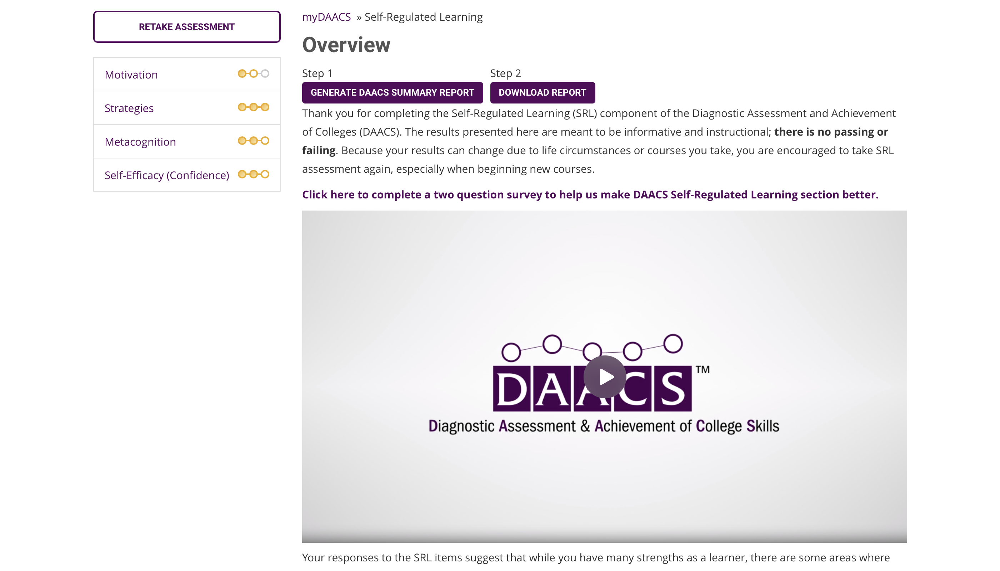
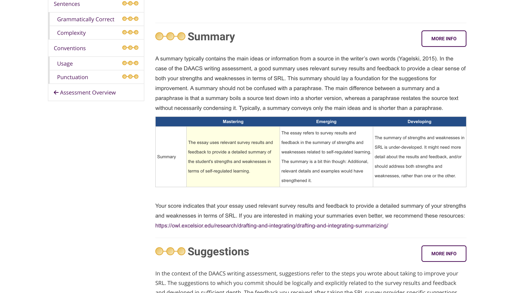
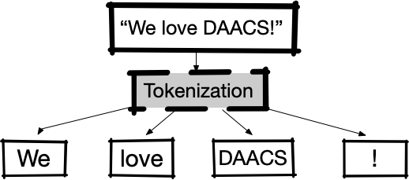

```{r setup, include = FALSE}
library(rmarkdown)
library(ggplot2)

# essays <- readRDS('../data/DAACS_Essays.rds')
essays <- read.csv('../data/EssayRatings.csv')

criteria <- c("Content_Summary", "Content_Suggestions",
			  "Organization_Structure", "Organization_Transition",
			  "Paragraphs_Focus_on_a_Main_Idea", "Paragraphs_Cohesion",
			  "Sentences_Correct", "Sentences_Complex",
			  "Conventions")

predictions <- readRDS('../data/predictions.rds')
ratings <- read.csv('../data/WGU-Ratings.csv')
daacs_essays <- readRDS("../data/DAACS_Essays.rds")

predictions$prediction_int <- predictions$prediction |> round() |> as.integer()
predictions <- predictions |>
	dplyr::filter(model != 'LinearRegression') |>
	dplyr::filter(domain != 'TotalScore')
predictions$prediction_int |> is.na() |> table()
ratings[!ratings$Corated,30:39] <- ratings[!ratings$Corated,5:14]
ratings_melted <- ratings[,c(2,30:38)] |> reshape2::melt(id.vars = 'EssayID', value.name = 'ActualScore')
predictions <- merge(predictions, ratings_melted,
					 by.x = c('daacs_id', 'domain'),
					 by.y = c('EssayID', 'variable'),
					 all.x = TRUE)
predictions$ActualScore <- predictions$ActualScore - 1
predictions$Accurate <- predictions$ActualScore == predictions$prediction_int
predictions <- predictions |>
	dplyr::filter(domain != 'Corated')

```

class: center, middle, inverse, title-slide

# `r metadata$title`
## `r metadata$subtitle`
### `r metadata$author`
### `r metadata$date`


---
# Introduction

* In the last few years there have been significant advances in the analysis of text data, specifically the introduction of Large Language Models (LLMs, e.g. OpenAI, Anthropic, etc.).

* The development of LLMs has been largely driven by *transformer* models ([Vaswani et all, 2017](https://proceedings.neurips.cc/paper/2017/file/3f5ee243547dee91fbd053c1c4a845aa-Paper.pdf)).

* The Diagnostic Assessment and Achievement of College Skills has been using [LightSide](https://ankara.lti.cs.cmu.edu/side/) (Mayfield, Adamson & Rosé, 2015) to score essays. 

### Research Question

Do the more modern tokenizers perform better than the traditional rule-based tokenizers?


---
# What is DAACS?

* A suite of technological and social support to optimize student learning.

* No-stakes, diagnostic (formative?) assessments in:
	* Self-Regulated Learning
	* Writing
	* Reading Comprehension
	* Mathematics

* Provides students with immediate feedback about strengths and weaknesses along with links to open educational resources (OER).

* Coaches, Academic Advisors, and Instructors can utilize student results to provide more targeted supports.

* Data is used in predictive analytic efforts to increase the accuracy of identifying "at-risk" students.

---
# DAACS Dashboard

```{r, echo=FALSE, fig.align='center'}

```

---
# DAACS Self-Regulated Learning Results

```{r, echo=FALSE, fig.align='center'}

```

---
# DAACS Writing Prompt

```{r, echo=FALSE, fig.align='center'}

```

---
# DAACS Writing Results

```{r, echo=FALSE, fig.align='center'}

```

---
# DAACS Writing Feedback Rubric

```{r, echo=FALSE, fig.align='center'}

```


---
class: font70
# Rubric (cont.)

```{r, echo=FALSE}
rubric <- readxl::read_excel('../data/DAACS-Writing-Rubric.xlsx')
knitr::kable(rubric[1:3,])
```

---
class: font70
# Rubric (cont.)

```{r, echo=FALSE}
rubric <- readxl::read_excel('../data/DAACS-Writing-Rubric.xlsx')
knitr::kable(rubric[4:6,])
```

---
class: font70
# Rubric (cont.)

```{r, echo=FALSE}
rubric <- readxl::read_excel('../data/DAACS-Writing-Rubric.xlsx')
knitr::kable(rubric[7:9,])
```

---
# Data Source

.pull-left[

`r prettyNum(nrow(essays), big.mark=',')` essays were collected from Western Governors University and the University at Albany, `r sum(!is.na(essays$TotalScore2))` of which were double scored. For WGU, the first 893 essays that were collected as part of a larger randomized control trial were included. The remaining essays were randomly selected from the University at Albany.

There were two scoring events with a total of 15 raters supervised by two subject matter experts.

]
.pull-right[
```{r, echo=FALSE}
irr <- data.frame(
	Criteria = gsub('_', ' ', criteria),
	IRR = sapply(criteria, FUN = function(x) { mean(essays[,paste0(x, '1')] == essays[,paste0(x, '2')], na.rm = TRUE) })
)
knitr::kable(irr, row.names = FALSE, digits = 2)
```
]

---
# Workflow for automated machine scoring


```{r, echo=FALSE, fig.align='center'}

```

<br/><br/>

For this study predictive models were trained on 75% of the observations. Prediction accuracies are calculated from the test data.

For essays that were double scored, the conferral score was used. Otherwise the single rater score was used.

---
# Tokenization

Tokenization is the process of coverting text into vectors or matrices.

```{r, echo=FALSE, fig.align='center'}

```

[Vaswani et al](https://proceedings.neurips.cc/paper/2017/file/3f5ee243547dee91fbd053c1c4a845aa-Paper.pdf) (2017) introduced the *transformer* model approach to tokenization. Unlike traditional rule based tokenization, transformer models are trained on a large corpus of text in order to not only find the basic word structures, but to also to infer context by finding nearby reoccurring tokens.

---
# Tokenizers and Predictive Models

.pull-left[

```{r, echo=FALSE}
tokenization_methods <- readxl::read_excel('../data/tokenization_methods.xlsx')
knitr::kable(tokenization_methods[,1:2])
```

]
.pull-right[

```{r, echo=FALSE}
prediction_methods <- readxl::read_excel('../data/prediction_methods.xlsx')
knitr::kable(prediction_methods[,1:2])
```

]

---
class: font80
# Version 1: LightSide Features


```{r, echo=FALSE}
lightside <- read.csv('../data/LightSide_Features.csv')
knitr::kable(lightside)
```

[LightSide](https://ankara.lti.cs.cmu.edu/side/) (Mayfield, Adamson & Rosé, 2015)

---
# Version 1: IRR and LightSide Accuracy


```{r version-one, eval=TRUE, echo=FALSE, results='asis'}
v1tab <- readxl::read_excel('../data/DAACS-Results-V1.xlsx') |>
	dplyr::arrange(Criteria)
knitr::kable(v1tab[,-3])
```


---
# Results

```{r results-plot, eval=TRUE, echo=FALSE, warning=FALSE, message=FALSE, fig.align='center', fig.height=8, fig.width=12, results='hide'}
tab <- predictions |>
	dplyr::group_by(domain, tokenizer, model) |>
	dplyr::summarise(Accuracy = mean(Accurate, na.rm = TRUE))

tab[tab$domain == 'Paragraphs_Focus_on_a_Main_Idea',]$domain <- 'Paragraphs_Focus'
tab$domain <- gsub('_', '\n', tab$domain)

p1 <- ggplot(tab, aes(x = Accuracy, y = model, color = tokenizer)) +
	geom_point() +
	facet_grid(~ domain) +
	ylab('') +
	# theme_minimal() +
	theme(legend.position = 'bottom', plot.background = element_rect(fill = 'transparent', color = NA)) +
	guides(color = guide_legend(nrow=1,byrow=TRUE))

p2 <- ggplot(tab, aes(x = Accuracy, y = tokenizer, color = model)) +
	geom_point() +
	facet_grid(~ domain) +
	ylab('') +
	# theme_minimal() +
	theme(legend.position = 'bottom', plot.background = element_rect(fill = NA)) +
	guides(color = guide_legend(nrow=1,byrow=TRUE))
cowplot::plot_grid(p1, p2, ncol = 1) #+ theme(plot.background = element_rect(fill = NA))
```

---
# Results: Top performing models by criteria

```{r best-models, eval=TRUE, echo=FALSE, results='asis', message=FALSE, warning=FALSE}
tab <- predictions |>
	dplyr::group_by(domain, tokenizer, model) |>
	dplyr::summarise(Accuracy = mean(Accurate, na.rm = TRUE)) |>
	dplyr::mutate(domain = gsub('_', ' ', domain)) |>
	dplyr::arrange(domain) |>
	dplyr::arrange(desc(Accuracy)) |>
	dplyr::ungroup() |>
	dplyr::distinct(domain, .keep_all = TRUE) |>
	dplyr::arrange(domain) |>
	dplyr::rename(Criteria = domain, Toeknizer = tokenizer, `Predictive Model` = model,
				  `Human-LLM` = Accuracy) 

cbind(tab, v1tab[,c(2,4)]) |> 
	dplyr::mutate(Improvement = `Human-LLM` - `Human-LightSide`) |> 
	knitr::kable(digits = 2)

```


---
# Discussion

* In general, the new generation of tokenizers are an improvement over the rule based tokenizers.

* The more modern tokenizers (e.g. BERT, SciKit Vectors, word2vec, etc.) all perform equally well. 

* The choice of predictive model seems to have a bigger impact on model accuracy. This is consistent with prior research (see e.g. [Fernández-Delgado, Cernados, Barro, & Amorin, 2014](https://jmlr.org/papers/volume15/delgado14a/delgado14a.pdf)).

* These new models will soon be integrated into the DAACS system.


---
class: inverse, middle, hide-logo, font100


```{r, echo=FALSE, fig.width=5, fig.height=5, out.extra='style="float:right; padding:10px"'}
qrcode::qr_code('https://github.com/DAACS/Writing-Assessment') |> plot(col = c('#005DAC', 'white'))
```

# Thank You!

[`r icons::fontawesome("paper-plane")` jason.bryer@cuny.edu](mailto:jason.bryer@cuny.edu)  
[`r icons::fontawesome("github")` @DAACS](https://github.com/DAACS/Writing-Assessment)  
[`r icons::fontawesome('link')` www.daacs.net](https://daacs.net)  

<br/><br/><br/><br/><br/><br/>

.font50[DAACS was developed under grants #P116F150077 and #R305A210269 from the U.S.
Department of Education. However, the contents do not necessarily represent the policy of the
U.S. Department of Education, and you should not assume endorsement by the Federal
Government.]
